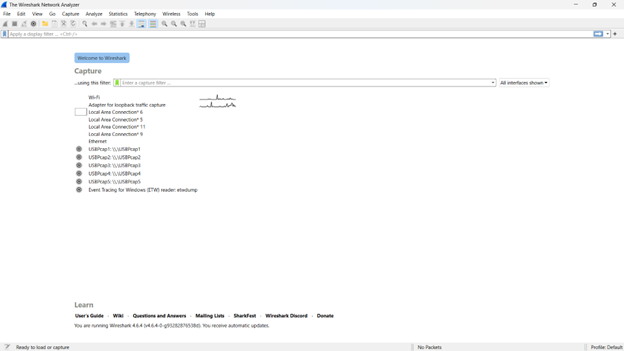

# laporan Praktikum Jarkom IF

## langkah Percobaan
1. install iso wireshark
2. download wireshark
3. dst

## Lampiran
Pertama, buka wireshark pencet dua kali tulisan “wifi”:

Setelah masuk, lalu ketik http

